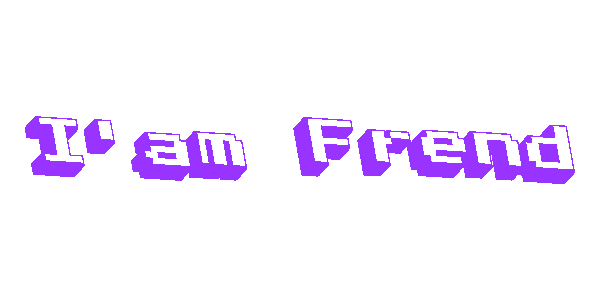

    

<h3 align="center">[ Fullstack Developer | Software Engineer ]</h3>

--- 

### 💻 Languages

    

    
### 🤖 Technologies

    

### 👨‍💻 All of my projects are available at

https://maspren-porto.netlify.app/

  

  

<a> 
    
  
   
</a>
